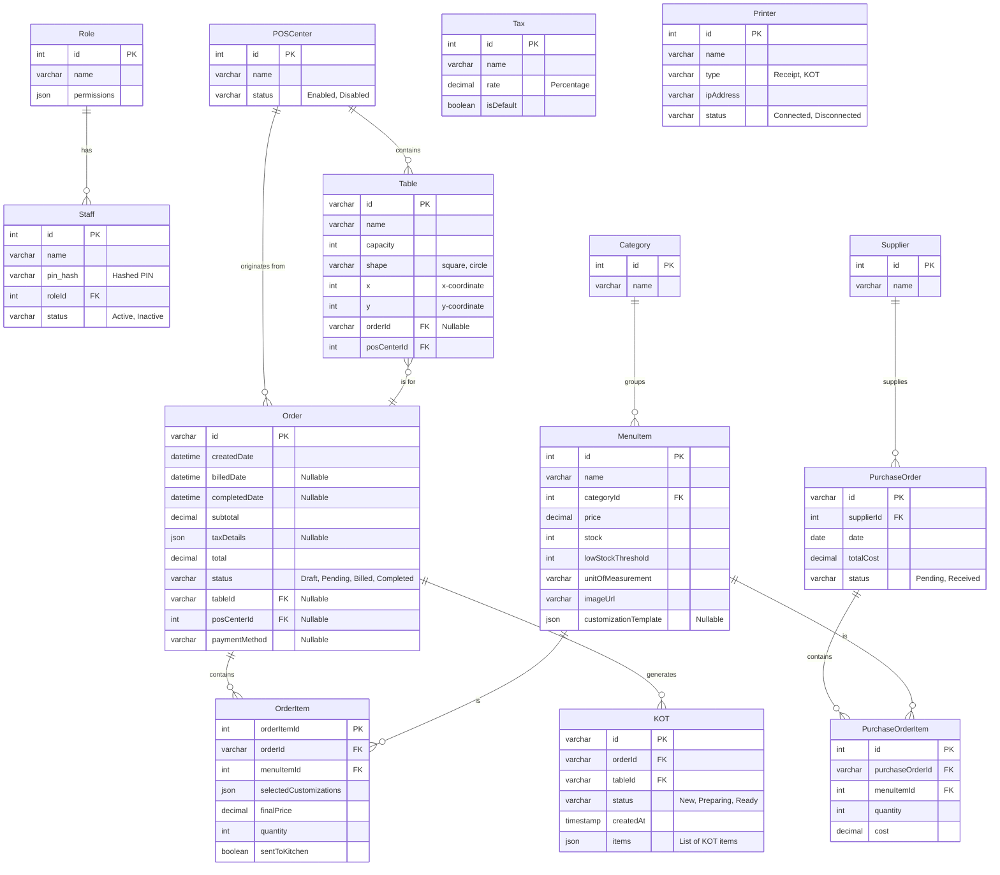

# Database Schema for POS & Management System

This document outlines the database schema for the Point of Sale (POS) and restaurant management system. It details the structure of each table, the fields they contain, and the relationships between them.

## Entity-Relationship Diagram (ERD)

---

## Table Schemas

### 1. `Staff`

Stores information about employees who can access the system.

| Field Name | Data Type        | Description                                       | Notes                                |
|------------|------------------|---------------------------------------------------|--------------------------------------|
| `id`       | INT (PK)         | Unique identifier for the staff member.           | Auto-incrementing primary key.       |
| `name`     | VARCHAR          | Full name of the staff member.                    |                                      |
| `pin`      | VARCHAR          | The hashed 4-digit PIN used for login.            | **Security**: Never store plain text PINs. |
| `roleId`   | INT (FK)         | Foreign key referencing the `Role` table.         | Links to `Role.id`.                  |
| `status`   | VARCHAR          | The employment status of the staff member.        | Enum: 'Active', 'Inactive'.          |

### 2. `Role`

Defines roles and their associated permissions within the system.

| Field Name    | Data Type  | Description                                | Notes                                               |
|---------------|------------|--------------------------------------------|-----------------------------------------------------|
| `id`          | INT (PK)   | Unique identifier for the role.            | Auto-incrementing primary key.                      |
| `name`        | VARCHAR    | The name of the role (e.g., Manager, Waiter). |                                                     |
| `permissions` | JSON/TEXT  | A list of permission strings granted to this role. | Storing as JSON is flexible.                        |

### 3. `POSCenter`

Represents different points of sale within the establishment (e.g., Main Restaurant, Rooftop Bar).

| Field Name | Data Type | Description                                 | Notes                                  |
|------------|-----------|---------------------------------------------|----------------------------------------|
| `id`       | INT (PK)  | Unique identifier for the POS center.       | Auto-incrementing primary key.         |
| `name`     | VARCHAR   | The name of the POS center.                 |                                        |
| `status`   | VARCHAR   | Whether the POS center is active or not.    | Enum: 'Enabled', 'Disabled'.           |

### 4. `Table`

Stores information about the physical tables in the restaurant, including their layout.

| Field Name | Data Type | Description                                    | Notes                                   |
|------------|-----------|------------------------------------------------|-----------------------------------------|
| `id`         | VARCHAR (PK) | Unique identifier for the table (e.g., 't1'). | Primary key.                            |
| `name`       | VARCHAR   | The display name of the table (e.g., 'T1').    |                                         |
| `capacity`   | INT       | The number of seats at the table.              |                                         |
| `shape`      | VARCHAR   | The shape of the table for the floor plan.     | Enum: 'square', 'circle'.               |
| `x`          | INT       | The x-coordinate for the floor plan layout.    |                                         |
| `y`          | INT       | The y-coordinate for the floor plan layout.    |                                         |
| `orderId`    | VARCHAR (FK) | Foreign key referencing the current `Order` for this table. | Nullable. Links to `Order.id`.    |
| `posCenterId`| INT (FK)  | Foreign key referencing the `POSCenter` it belongs to. | Links to `POSCenter.id`.          |

### 5. `Category`

Defines categories for grouping menu items (e.g., Appetizers, Main Course).

| Field Name | Data Type | Description                           | Notes                          |
|------------|-----------|---------------------------------------|--------------------------------|
| `id`       | INT (PK)  | Unique identifier for the category.   | Auto-incrementing primary key. |
| `name`     | VARCHAR   | The name of the category.             |                                |

### 6. `MenuItem`

Stores details for each item on the menu.

| Field Name            | Data Type     | Description                                         | Notes                                  |
|-----------------------|---------------|-----------------------------------------------------|----------------------------------------|
| `id`                  | INT (PK)      | Unique identifier for the menu item.                | Auto-incrementing primary key.         |
| `name`                | VARCHAR       | The name of the menu item.                          |                                        |
| `categoryId`          | INT (FK)      | Foreign key referencing the `Category` table.       | Links to `Category.id`.                |
| `price`               | DECIMAL       | The base price of the item.                         | Use DECIMAL for currency precision.    |
| `stock`               | INT           | The current quantity in stock.                      |                                        |
| `lowStockThreshold`   | INT           | The stock level at which to trigger a "low stock" warning. |                                        |
| `unitOfMeasurement`   | VARCHAR       | The unit for stock tracking (e.g., 'pcs', 'kg').    |                                        |
| `imageUrl`            | VARCHAR       | URL for the item's image.                           |                                        |
| `customizationTemplate`| JSON/TEXT    | A schema defining available customizations.         | Nullable.                              |

### 7. `Order`

Represents a single customer order. This is a central table in the system.

| Field Name      | Data Type | Description                                        | Notes                                   |
|-----------------|-----------|----------------------------------------------------|-----------------------------------------|
| `id`            | VARCHAR (PK)| Unique identifier for the order (e.g., 'ORD-123').| Primary key.                            |
| `createdDate`   | DATETIME  | Timestamp when the order was created.              |                                         |
| `billedDate`    | DATETIME  | Timestamp when the bill was generated.             | Nullable.                               |
| `completedDate` | DATETIME  | Timestamp when the payment was completed.          | Nullable.                               |
| `subtotal`      | DECIMAL   | The total price of all items before tax.           | Use DECIMAL for currency precision.     |
| `taxDetails`    | JSON/TEXT | Object storing tax name, rate, and calculated amount. | Nullable.                               |
| `total`         | DECIMAL   | The final amount including tax.                    | Use DECIMAL for currency precision.     |
| `status`        | VARCHAR   | The current status of the order.                   | Enum: 'Draft', 'Pending', 'Billed', 'Completed'. |
| `tableId`       | VARCHAR (FK)| Foreign key referencing the `Table` for this order. | Nullable. Links to `Table.id`.          |
| `posCenterId`   | INT (FK)  | Foreign key referencing the `POSCenter`.           | Nullable. Links to `POSCenter.id`.      |
| `paymentMethod` | VARCHAR   | The method used for payment.                       | Nullable. Enum: 'Cash', 'Card', 'Other'. |

### 8. `OrderItem`

A line item within an `Order`, linking an order to a specific `MenuItem`.

| Field Name               | Data Type | Description                                         | Notes                               |
|--------------------------|-----------|-----------------------------------------------------|-------------------------------------|
| `orderItemId`            | INT (PK)  | Unique identifier for this specific line item.      | Auto-incrementing primary key.      |
| `orderId`                | VARCHAR(FK)| Foreign key referencing the `Order` table.          | Links to `Order.id`.                |
| `menuItemId`             | INT (FK)  | Foreign key referencing the `MenuItem` table.       | Links to `MenuItem.id`.             |
| `selectedCustomizations` | JSON/TEXT | A list of customizations chosen by the customer.    |                                     |
| `finalPrice`             | DECIMAL   | The price of this item including customizations.    | Use DECIMAL for currency precision. |
| `quantity`               | INT       | The quantity of this item ordered.                  |                                     |
| `sentToKitchen`          | BOOLEAN   | Flag indicating if this item has been sent to the KDS.| Defaults to `false`.                |

### 9. `KOT` (Kitchen Order Ticket)

Represents a ticket sent to the kitchen display system (KDS).

| Field Name  | Data Type   | Description                                           | Notes                                 |
|-------------|-------------|-------------------------------------------------------|---------------------------------------|
| `id`        | VARCHAR (PK)| Unique identifier for the KOT.                        | Primary key.                          |
| `orderId`   | VARCHAR(FK) | Foreign key referencing the `Order` table.            | Links to `Order.id`.                  |
| `tableId`   | VARCHAR(FK) | Foreign key referencing the `Table`.                  | Links to `Table.id`. For convenience. |
| `status`    | VARCHAR     | The current status of the ticket in the kitchen.      | Enum: 'New', 'Preparing', 'Ready'.    |
| `createdAt` | TIMESTAMP   | Timestamp when the KOT was created.                   |                                       |
| `items`     | JSON/TEXT   | A list of the new items to be prepared for this ticket. | Avoids complex joins from the KDS view. |

### 10. `Supplier`

Stores information about suppliers for inventory management.

| Field Name | Data Type | Description                         | Notes                          |
|------------|-----------|-------------------------------------|--------------------------------|
| `id`       | INT (PK)  | Unique identifier for the supplier. | Auto-incrementing primary key. |
| `name`     | VARCHAR   | The name of the supplier company.   |                                |

### 11. `PurchaseOrder`

Represents a purchase order made to a supplier.

| Field Name  | Data Type | Description                                 | Notes                                |
|-------------|-----------|---------------------------------------------|--------------------------------------|
| `id`        | VARCHAR(PK)| Unique identifier for the PO (e.g., 'PO-001').| Primary key.                         |
| `supplierId`| INT (FK)  | Foreign key referencing the `Supplier` table. | Links to `Supplier.id`.              |
| `date`      | DATE      | The date the purchase order was created.      |                                      |
| `totalCost` | DECIMAL   | The total cost of the purchase order.         | Use DECIMAL for currency precision.  |
| `status`    | VARCHAR   | The status of the purchase order.             | Enum: 'Pending', 'Received'.         |

### 12. `PurchaseOrderItem`

A line item within a `PurchaseOrder`.

| Field Name        | Data Type | Description                                      | Notes                               |
|-------------------|-----------|--------------------------------------------------|-------------------------------------|
| `id`              | INT (PK)  | Unique identifier for the PO line item.          | Auto-incrementing primary key.      |
| `purchaseOrderId` | VARCHAR(FK)| Foreign key referencing the `PurchaseOrder` table. | Links to `PurchaseOrder.id`.        |
| `menuItemId`      | INT (FK)  | Foreign key referencing the `MenuItem` table.    | Links to `MenuItem.id`.             |
| `quantity`        | INT       | The quantity of the item purchased.              |                                     |
| `cost`            | DECIMAL   | The cost per unit for this item.                 | Use DECIMAL for currency precision. |

### 13. `Tax`

Stores different tax rates that can be applied to orders.

| Field Name  | Data Type | Description                               | Notes                                  |
|-------------|-----------|-------------------------------------------|----------------------------------------|
| `id`        | INT (PK)  | Unique identifier for the tax.            | Auto-incrementing primary key.         |
| `name`      | VARCHAR   | Name of the tax (e.g., VAT, Service Charge).|                                        |
| `rate`      | DECIMAL   | The tax rate as a percentage.             | Use DECIMAL for precision.             |
| `isDefault` | BOOLEAN   | If `true`, this tax is applied by default.  | Only one tax should be the default.    |

### 14. `Printer`

Stores configuration for hardware printers.

| Field Name | Data Type | Description                             | Notes                                 |
|------------|-----------|-----------------------------------------|---------------------------------------|
| `id`       | INT (PK)  | Unique identifier for the printer.      | Auto-incrementing primary key.        |
| `name`     | VARCHAR   | A friendly name for the printer.        |                                       |
| `type`     | VARCHAR   | The function of the printer.            | Enum: 'Receipt', 'KOT'.               |
| `ipAddress`| VARCHAR   | The IP address of the printer on the network. |                                       |
| `status`   | VARCHAR   | The connection status of the printer.   | Enum: 'Connected', 'Disconnected'.    |

### 15. Configuration Tables

These tables typically hold a single row of data or key-value pairs for application-wide settings.

#### `PropertyDetails`

| Field Name | Data Type | Description                     |
|------------|-----------|---------------------------------|
| `name`     | VARCHAR   | The name of the business.       |
| `address`  | VARCHAR   | The physical address.           |
| `phone`    | VARCHAR   | Contact phone number.           |
| `email`    | VARCHAR   | Contact email address.          |
| `website`  | VARCHAR   | The business's website URL.     |

#### `CurrencySetting`

| Field Name  | Data Type | Description                                   |
|-------------|-----------|-----------------------------------------------|
| `code`      | VARCHAR   | The currency code (e.g., 'USD').              |
| `symbol`    | VARCHAR   | The currency symbol (e.g., '$').              |
| `name`      | VARCHAR   | The full name of the currency (e.g., 'US Dollar'). |
| `placement` | VARCHAR   | The position of the symbol. Enum: 'before', 'after'. |
